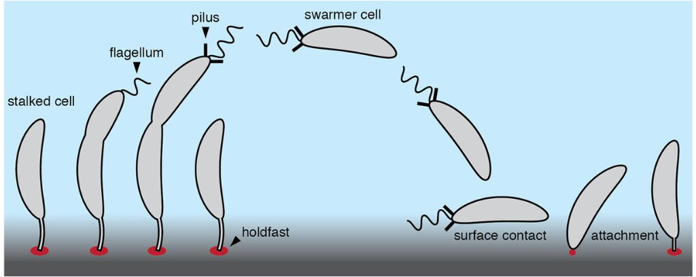
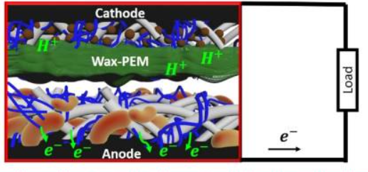
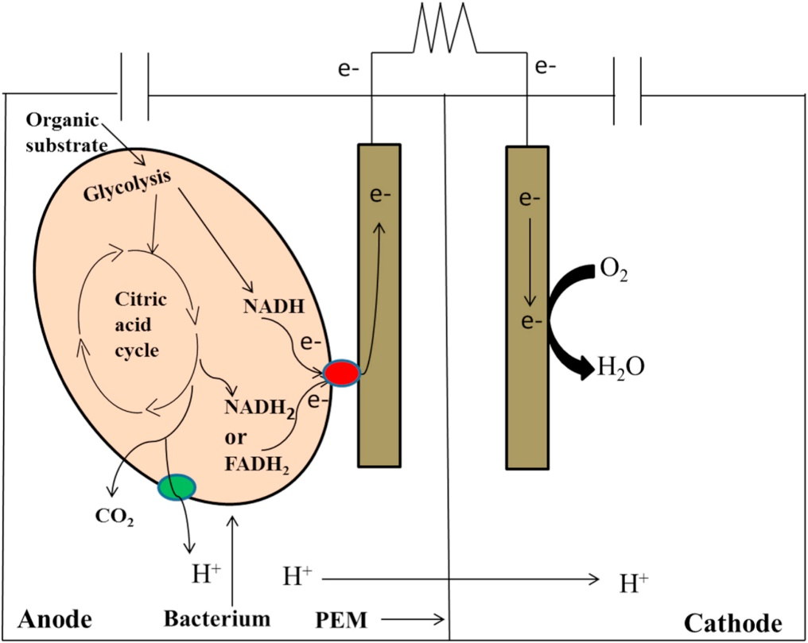

### Introduction

Integration of living microbes into electrochemical systems is a choice to produce electricity and the research is at a growing pace to identify its potential applications in microbial fuel cells, microbial biosensors, and bioreactors. These advances in the biotechnology field were mobilized with the use of so-called exoelectrogenic microorganisms, that can metabolize the chemical substrate through redox reaction at electrodes to produce electrical energy. The data indicated that around 50 bacteria were identified as exoelectrogenic that belong to the phyla Proteobacteria, Firmicutes, and Acidobacteria and the source of those strains were wastewater, lake and marine sediments, and a few from soil sediments. Even though many strains have been identified, limited bacteria can produce maximum power densities that make it important to understand bacterial mechanisms in current generation through the extracellular electron transfer system, cell respiration, and the cell-cell communication process. 

&nbsp;
### Theory

While constructing a microbial fuel cell (MFC), the electroactive microorganisms are the central point to produce electricity from the organic compounds. These microorganisms can transfer electrons outside of their cell to the anode of the MFC, these bacteria are termed exoelectrogens (where exo denotes extracellular and electrogens denote the ability to transfer electrons). They are also described as electrochemically active bacteria, anode-respiring bacteria, and electricigens. The performance of an MFC is determined by its ability to produce power and depends directly on the kinetics of electron transfer by the exoelectrogenic bacteria. The studies on extracellular transport mechanisms of electrons of different bacteria were still ongoing study. The electron transfer mechanisms can be by direct electron transfer via membrane-bound cytochromes, by using electrically conductive nanowires that are pili, or by mediated electron transfer by redox reactions. The evidence for the ability of microorganisms to release and accept electrons by microorganisms indicated a natural phenomenon of electron exchange between cells in the microbial community. The best examples of the most widely used electrogens are Geobacter sulfurreducens, Geobacter metallireducens, and Shewanella oneidensis among many other bacterial species. Other common examples that can be used for MFC are Shewanella putrefaciens, Desulfuromonas acetoxidans , Rhodoferax ferrireducens, Klebsiella pneumoniae, etc. 
&nbsp;
### Characteristics of Caulobacter crescentus

Like the microorganism discussed above, Caulobacter crescentus is also an exoelectrogenic microorganism used in MFCs to generate electricity through an extracellular electron transfer process. It belongs to the order Caulobacterales and is found distributed in freshwater lakes and streams. It is a gram-negative, oligotrophic microorganism. It is characterized by the presence of stalk, a thin tubular extension of the cell body. It has a crescent shape, due to the presence of protein crescentin. This microorganism can withstand nutrient-poor aquatic environments such as ponds, lakes, and streams through cellular adaptation mechanisms. It employs a dimorphic life cycle with two differentiated cell types, a nonreproductive motile swarmer cell, and a reproductive nonmotile stalked cell. Swarmer cells having single flagella is meant for chemotaxis and stalked cell, which is tubular protrudes from one pole to adhere to other surfaces. With environmental factors, the swarmer cell sheds its flagellum and disassembles pili to transit into a stalked-cell form. In stalk cell form, a stalk is produced at the pole after the disassembly of the flagellum and pili. Polysaccharide-rich matrix called the holdfast is produced during the swarmer-cell-to-stalked-cell transition that aids in adhesion to the exogenous surfaces (Fig.1). It is negative for the indole test, Voges Proskauer test, and positive for methyl red and the citrate utilization test. 

&nbsp;

Fig.1. Structural overview of Caulobacter crescentus, an exoelectrogen in MFC

Adapted from Hershey, D. M., Fiebig, A., & Crosson, S. (2019). A genome-wide analysis of adhesion in Caulobacter crescentus identifies new regulatory and biosynthetic components for holdfast assembly. MBio, 10(1), 10-1128.)
&nbsp;
### Demonstrating exoelectrogenesis using Caulobacter crescentus
The design and construction of a double-chambered MFC is depicted in Experiment 1. This experiment explains how the novel organism Caulobacter crescentus can perform exoelectrogenesis in a laboratory built low-cost MFC. 0.01% peptone water cultured with electricigens, was used as anolyte in the MFC. Generally, the microorganism in the anodic chamber undergoes metabolic processes and releases electrons as a byproduct. The electrons flow from the anode electrode to the cathode through an external circuit and this flow constitutes electric current generation. At the cathode, the electron acceptors consume electrons and protons from the anode and reduce water. 
Energy acquisition is an essential part of all living organisms. Living things including humans store energy through respiration, where organic compounds are electron donors and oxygen as electron acceptors. Most microorganisms depend on inorganic substrates for the respiration process. Some microbes can obtain energy by electron transport to and from solid extracellular substances. The microbial metabolism is termed an extracellular electron transfer (EET) mechanism (Fig.2). In other words, the exchange of intracellular electrons with an extracellular electron donor/acceptor by microorganism is EET, that biocatalysts microbial fuel cells and microbial electrosynthesis. The microbial cell envelope has a cytoplasmic membrane which is the primary barrier to the external features and acts as the electron transfer center and source for microbial energy generation. The external structures such as the peptidoglycan layer, outer membrane, and S-layer are non-conductive and impermeable to minerals.  

 

Fig.2. Conceptual image of microbial exoelectrogenesis (Adapted from Tahernia, M., Plotkin-Kaye, E., Mohammadifar, M., Gao, Y., Oefelein, M. R., Cook, L. C., & Choi, S. (2020). Characterization of electrogenic gut bacteria. ACS omega, 5(45), 29439-29446.)

To overcome these barriers, each microorganism has evolved specialized mechanisms to promote the exchange of electrons. Caulobacter crescentus releases electron shuttles (small soluble molecules) such as flavins extracellularly for facilitating electron transfer from bacteria to minerals and electrodes. The reduced-form flavins can transfer electrons directly to minerals that contain Fe (III). In some cases, Caulobacter crescentus has direct contact with electrodes in the MFC through nanowires termed as pili which are formed by the protein filaments in the cell envelope. These electrically conductive pili facilitate electron transfer between cells of the microorganism and to Fe (III) oxides or oxyhydroxides. The ability of Caulobacter crescentus to form biofilms on electrode surfaces also contributes to its exoelectrogenesis property. Biofilms have bacterial cells in the extracellular matrix that promotes contact with bacteria and electrode enhancing electron transfer efficiency. During the process, released protons at the anode are transferred to the cathode through the PEM where they combine with oxygen and electrons to form water (Fig.3).
&nbsp;

Fig.3. Demonstration of exoelectrogenesis using bacterium at anode (Adapted from Kumar, R., Singh, L., & Zularisam, A. W. (2016). 

Exoelectrogens: recent advances in molecular drivers involved in extracellular electron transfer and strategies used to improve it for microbial fuel cell applications. Renewable and Sustainable Energy Reviews, 56, 1322-1336.) 

Studies indicated that the selection of anodic material with a specific surface area is a crucial point for facilitating bacterial attachment to the electrode for increasing the EET smoothly thereby increasing the MFC performance. In most cases, a narrow range of electrogenic Gram-negative bacteria was examined for EET as Gram-positive bacteria have thick peptidoglycan layers and are thought to be less electrogenic. Studies on EET pathways Listeria monocytogenes and Enterococcus faecalis provided insights into metabolic pathways of EET in Gram-positive bacteria.
